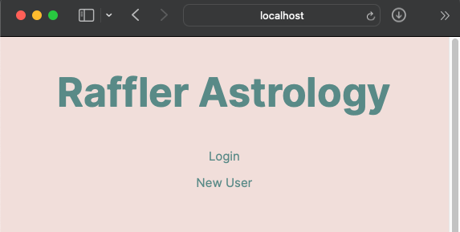
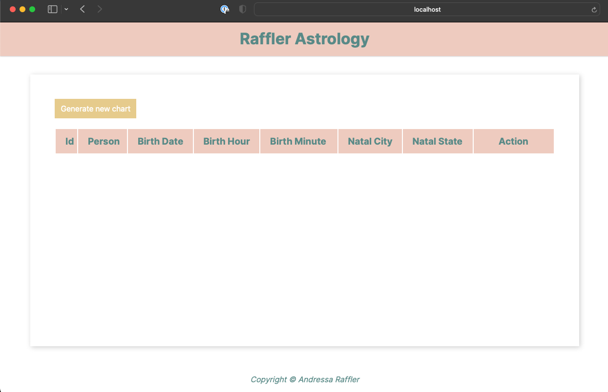
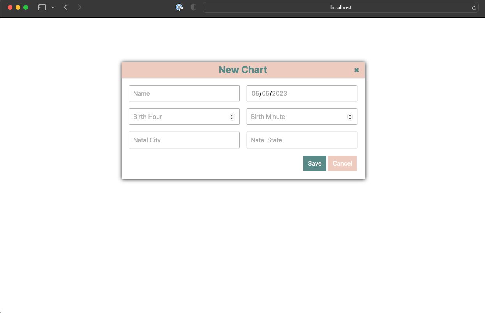

# **Birth Chart API Calculator**

## PRÉ REQUISITOS
Para inicializar o projeto será necessária a instalaçao das seguintes ferramentas na sua máquina:
 - Docker
 - Java 17
 - Maven 4.0

## START NA APLICAÇAO
Primeiro, clone o meu repositório
```
git clone https://github.com/andressa-raffler/Astrology.git
```

Após clonar o repositório será necessário buildar localmente o projeto, para isso Após clonar o projeto, navegue até a 
pasta astrology (pasta que contem o arquivo docker-compose.yml) e rode o comando:

```
mvn clean install
```

Após completar o build, a pasta target será criada.
Com o docker rodando, suba os containers do projeto com o comando: 
```
docker-compose up -d
```
O comando deverá rodar uma instancia do postgres com os seguintes dados de acesso:
```
URL: jdbc:postgresql://db:5432/postgres
Username: postgres
Password: postgres
```
Os dados acima podem ser alterados conforme preferencia, para isso, basta alterar o arquivo docker-compose.yml

O docker também irá rodar uma imagem do NGINX para o frontend que ficará disponível na seguinte URL:
```
http://localhost:8081/
```
Agora navegue para dentro da pasta target e execute o java para inicializar o backend:
```
cd target
java -jar Astrology-0.0.1-SNAPSHOT.jar
```

Ao acessar o localhost a seguinte página deverá ser exibida:



Crie entao um novo usuário para posteriormente poder logar na aplicaçao
Após logar será possível criar, visualizar, editar e deletar mapas astrais






# Projeto desenvolvido com as seguintes tecnologias:

## Backend:
  - Java;
  - SpringBoot;
  - Postgres SQL;
  - Docker;
  - REST API;
  - MapStruct;

## Frontend:
  - JavaScript;
  - HTML;
  - CSS;
